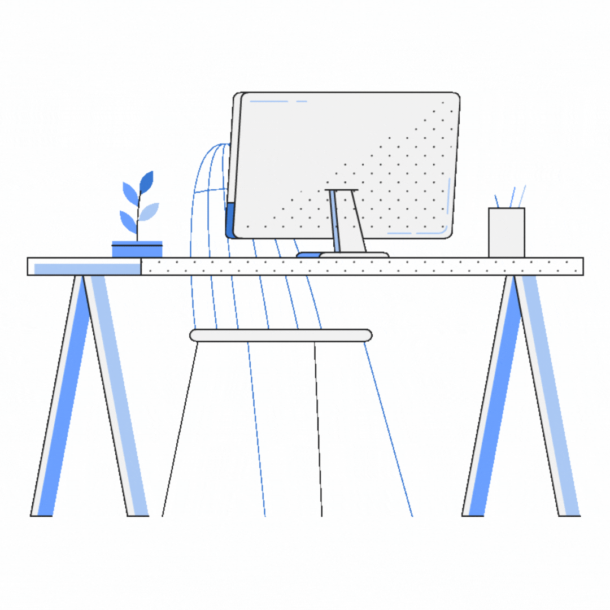

### Hi there 👋 I'm Hector, a full stack developer!

I am a full stack developer who loves taking on new and challenging projects. 

In my free time I love travelling, photography and filmmaking. As a former gymnast, sport is an important part of my life. I also have a keen interest in IoT technology, specifically HomeKit.

### What I'm working on

- Working at Gohr, a last mile delivery company, as a Lead Frontend Developer.
- Working on deploying gymnastics app RoutineLab.

### Tools I've been using lately

 
    
   
   
    
   
    
   
    

<!--
**hectorkd/hectorkd** is a ✨ _special_ ✨ repository because its `README.md` (this file) appears on your GitHub profile.

Here are some ideas to get you started:

- 🔭 I’m currently working on ...
- 🌱 I’m currently learning ...
- 👯 I’m looking to collaborate on ...
- 🤔 I’m looking for help with ...
- 💬 Ask me about ...
- 📫 How to reach me: ...
- 😄 Pronouns: ...
- ⚡ Fun fact: ...
-->
